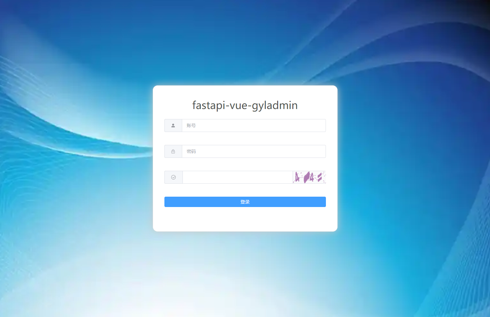
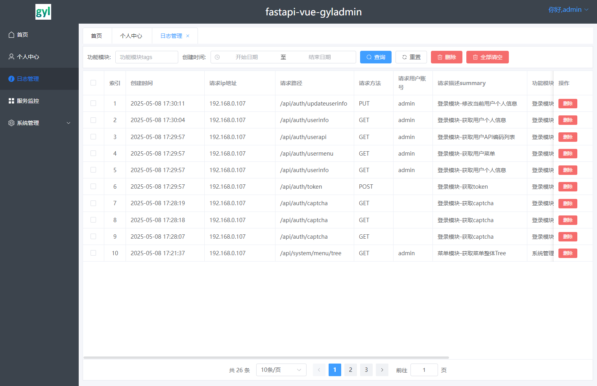
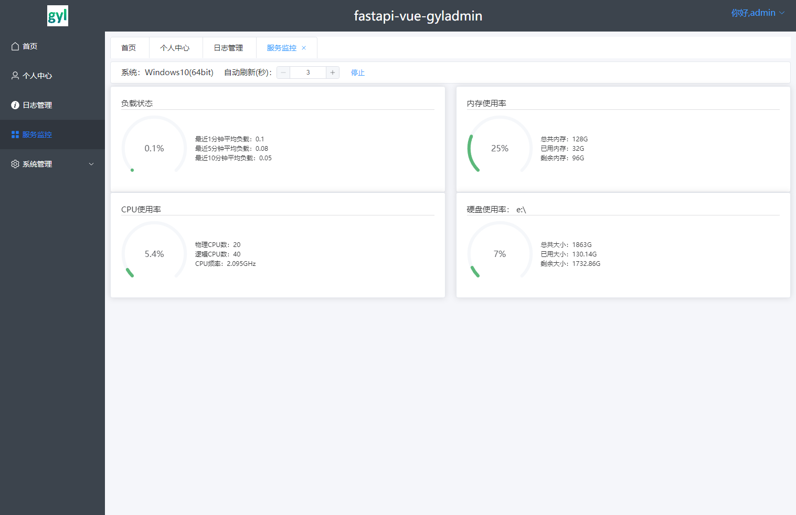
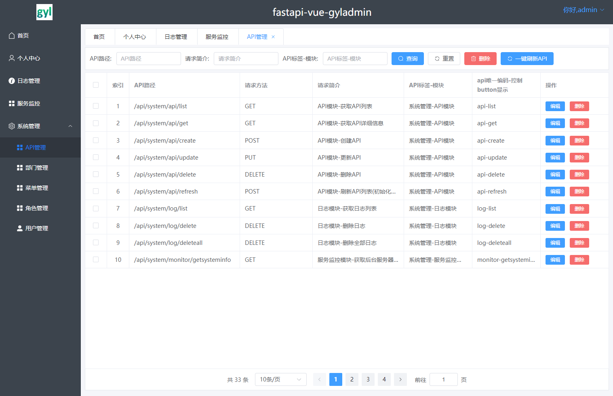
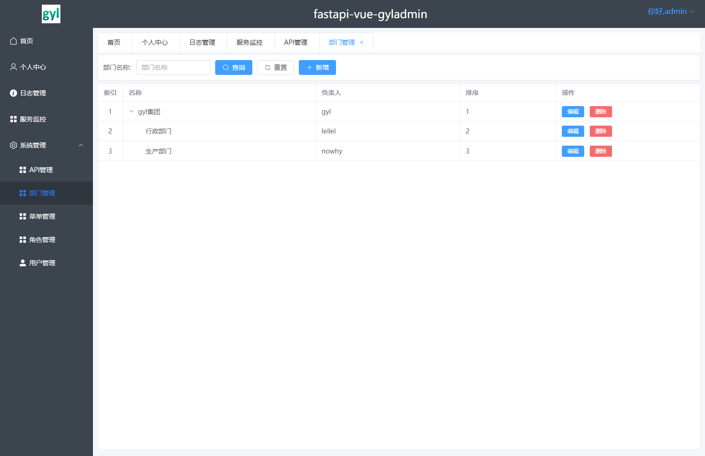
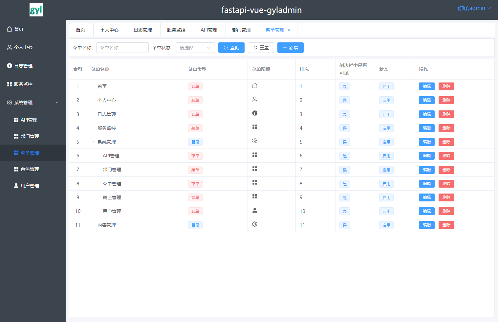
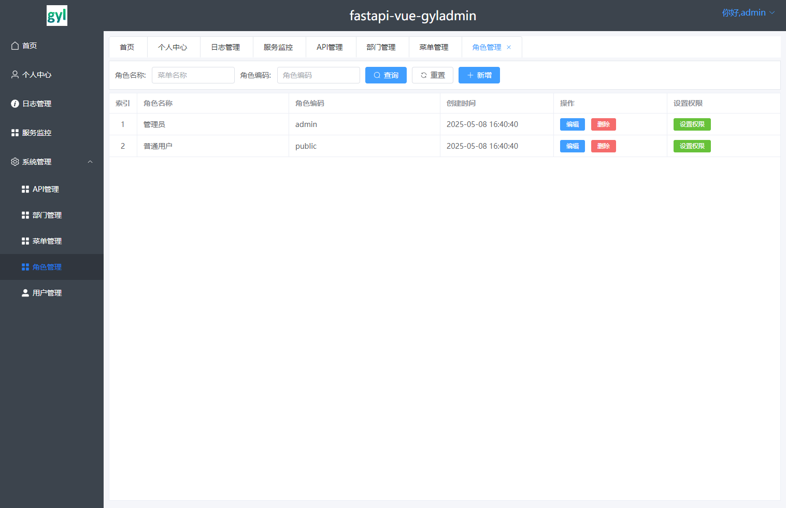
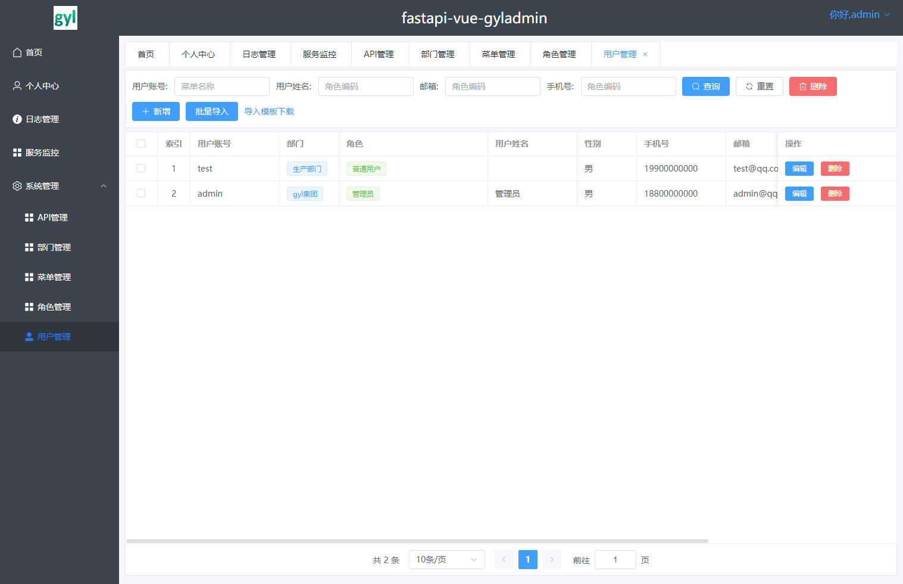

# fastapi-vue-gyladmin
#### 编程环境

#### 后端库环境

#### 前端库环境

#### 个人Github

<!--  -->

## TODO

* 1.前端->优化前端界面:(设置权限弹窗高度问题)
* 2.后端->增加API限流: [slowapi-适合中低请求量和多线程,满足需求](https://pypi.org/project/slowapi/) 分布式采用redis、数据库等可实现
* 3.后端->增加缓存: [fastapi-cache2](https://pypi.org/project/fastapi-cache2/)
* 
* 定制开发：
* 1.增加WebGIS可视化、首页定制化、AI大模型问答界面

## 1-系统原型平台介绍

fastapi-vue-gyladmin 是一套python fastapi vue3(javascript)前后端分离的web系统开发平台, 系统平台定位是仅提供rbac的一套基础系统平台, 供其它开发者在此基础上定制开发; 无其它繁杂的界面和代码, 简洁明了!!!

* 系统平台有用户、角色、部门、菜单、API(权限)、日志、监控等基础模块
* 前端采用vite、vue3、element-plus、pinia、vue-router、echarts、axios等库开发, 使用javascript开发
* 后端采用python语言, fastapi、tortoise-orm、pydantic、PyJWT、uvicorn、passlib、python-multipart等库开发
* 权限认证采用jwt (PyJWT), 支持多终端认证系统
* API采用fastapi, 支持OpenAPI文档, 支持后台管理不同用户的API访问权限
* 前端界面支持动态菜单显示权限(由后台数据库动态设置用户角色菜单决定)
* 适合刚入门、删繁就简的开发小伙伴们, 主打简洁、易学、好用, 而且代码简洁明了

wiki文档地址
* 文档地址：本项目的wiki中会持续更新

## 2-功能界面介绍

01. 首页: 数据统计分析查看 
02. 个人中心: 个人信息、密码的修改
- 以下3-9均为管理员可见
03. 日志管理: 操作日志的查询、删除
04. 服务监控: 监控部署的机器运行情况
05. 系统管理-API管理: 后端开发api后, 仅需refresh-api, 授予每个api不一样的code即可 (用于前端按钮显示)
06. 系统管理-部门管理: 配置系统组织机构
07. 系统管理-菜单管理: 配置系统菜单
08. 系统管理-角色管理: 配置系统角色、分配角色菜单、角色API权限
09. 系统管理-用户管理: 管理用户角色、部门等信息、批量创建用户

<table>
    <tr>
        <td></td>
        <td></td>
    </tr>
    <tr>
        <td></td>
        <td></td>
    </tr>
    <tr>
        <td></td>
        <td></td>
    </tr>
    <tr>
        <td></td>
        <td></td>
    </tr>
<table>

## 3-系统安装部署教程

方式一: 本地测试部署

1. git clone或直接下载zip包到本地指定地址
2. 修改前端frontend/src/api/config.js _domain为127.0.0.1:8000
3. 修改后端backend/main.py host="127.0.0.1" port=8000
4. cmd中, cd backend
5. pip install -i https://mirrors.aliyun.com/pypi/simple/ -r requirements.txt
6. 先删除db.sqlite3数据库文件, 再执行init_app.py 初始化sqlite数据库(默认, 如需更改数据库请修改backend/config.py)
7. python main.py
8. cd frontend
9. npm install . 
10. npm run dev
11. 登录账号: admin, 密码: Aa123456; 登录账号: test, 密码: Aa123456

方式二: 打包部署(自行百度即可)
1. 虚拟机中-宝塔面板\1panel面板安装
2. 部署fastapi项目, nignx代理前端, uvicorn部署后端; 或者将前端打包放入fastapi static (b站搜索fastapi集成vue打包文件)

## 4-定制开发

1. 后端数据库更改: 修改backend/config.py 内参数即可
2. 重新执行init_app.py 初始化数据库
3. 后端API详细参数: http://127.0.0.1:8000/docs 查看测试相关模块API
4. 前后端开发即可, 后端参考system模块的代码标准写法

## 5-参与贡献

* [作者gengyanlei](https://github.com/gengyanlei)

## 6-参考(特别鸣谢): 

* 前端参考: [django-vue-lyadmin](https://gitee.com/lybbn/django-vue-lyadmin)
* 后端参考: [vue-fastapi-admin](https://gitee.com/mizhexiaoxiao/vue-fastapi-admin)
* 大模型指导理解代码: deepseek 等
* 主要在以上3个基础上, 同时借鉴了一点其它开源仓库部分, 重新编写优化前后端代码, 实现更优的体验!

